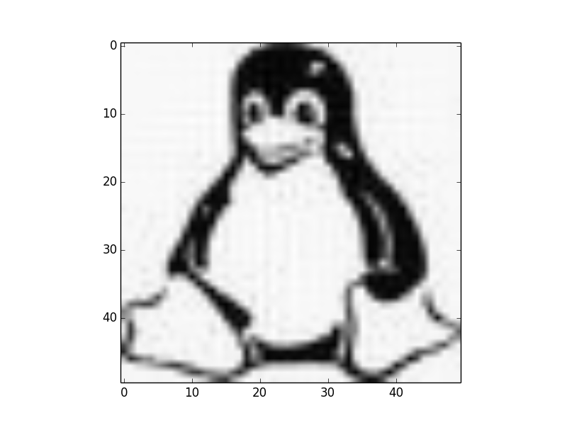
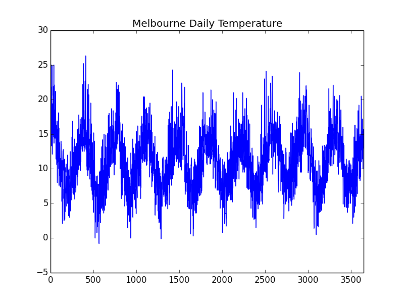
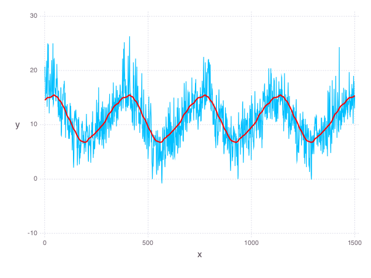
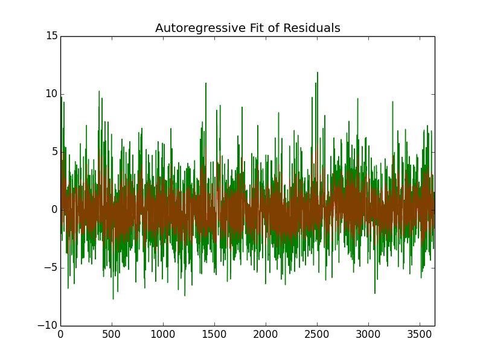

=============================
LineaLeastSquares.jl Examples
=============================

This tutorial showcases LinearLeastSquares.jl through a few involved examples of linearly
constrained least squares problems. We'll refer to LinearLeastSquares.jl as "LLS"
throughout.
The plots generated by the following examples use the Gadfly package.
The documentation on how to use Gadfly can be found `here <http://gadflyjl.org/>`_,
but by no means is it necessary to read unless you would like to create plots for yourself.
To install Gadfly, run the following command in a Julia shell

.. code-block:: none

  Pkg.add("Gadfly")

Some of the examples will also use data files, which can all be found `here <https://github.com/davidlizeng/LinearLeastSquares.jl/tree/master/examples/>`_.

Regression
==========
Regression is the problem of trying to fit a function to some data.
In this example, we will frame some simple regression problems as
unconstrained least squares problems for LLS to solve.

We are given n points, represented by two n-by-1 vectors, ``x_data`` and ``y_data``. The x and y coordinates of the i-th point are given by the i-th entries of ``x_data`` and ``y_data``, respectively.

We'll start by generating and visualizing some data to get a better sense of the problem at hand:

.. code-block:: none

  # Set the random seed to get consistent data
  srand(1)

  # Number of examples to use
  n = 100

  # Specify the true value of the variable
  true_coeffs = [2; -2; 0.5]

  # Generate data
  x_data = rand(n, 1) * 5
  x_data_expanded = hcat([x_data .^ i for i in 1 : 3]...)
  y_data = x_data_expanded * true_coeffs + 0.5 * rand(n, 1)

  p = plot(
    x=x_data, y=y_data, Geom.point,
    Theme(panel_fill=color("white"))
  )

The following graph of the data will appear

.. image:: data.png

Linear Regression
-----------------
We will first try to fit a line to the data. A general function for a line is

.. math::
  f(x) = \alpha + \beta x

where :math:`\alpha` is the offset and :math:`\beta` is the slope.
We would like to pick :math:`\alpha` and :math:`\beta` so that our data points lie "close" to
our line. For a point with coordinates :math:`x` and :math:`y` the residual between the point
and our line is defined as

.. math::
  r(x, y) = f(x) - y.

One reasonable way to measure the how different line is from the data is to
sum the squares of the residuals between each point in the data and the line:

.. math::
  E(\alpha, \beta) = \sum_{i = 1}^n (r(x_i, y_i))^2 = \sum_{i = 1}^n (\alpha + \beta x_i - y_i)^2.

We would like to choose :math:`\alpha` and :math:`\beta` to minimize this error.
We can now frame this problem in Julia code and solve our problem using LLS:

.. code-block:: none

  slope = Variable()
  offset = Variable()
  line = offset + x_data * slope
  residuals = line - y_data
  fit_error = sum_squares(residuals)
  optval = minimize!(fit_error)

  # plot the data and the line
  t = [0; 5; 0.1]
  p = plot(
    layer(x=x_data, y=y_data, Geom.point),
    layer(x=t, y=evaluate(slope) * t + evaluate(offset), Geom.line),
    Theme(panel_fill=color("white"))
  )

The line of best fit on our data is shown below:

  .. image:: linear_regression.png

Quadratic Regression
--------------------
A line is probably not the best function to fit to this data. Instead, let's try
to fit a quadratic function, which has the form:

.. math::
  f(x) = \alpha + \beta x + \gamma x ^ 2

where the new coefficient :math:`\gamma` corresponds to the quadratic term
A similar residual function from the linear regression example can be used here;
we measure the error of our quadratic fit by summing the squares of the
residuals

.. math::
  E(\alpha, \beta, \gamma) = \sum_{i = 1}^n (r(x_i, y_i))^2 = \sum_{i = 1}^n (\alpha + \beta x_i + \gamma x_i^2 - y_i)^2.

Again, we pick our coefficients to minimize the error.
Here is the Julia code to solve this problem using LLS and plot the quadratic:

.. code-block:: none

  quadratic_coeff = Variable()
  slope = Variable()
  offset = Variable()
  quadratic = offset + x_data * slope + quadratic_coeff * x_data .^ 2
  residuals = quadratic - y_data
  fit_error = sum_squares(residuals)
  optval = minimize!(fit_error)

  # Create some evenly spaced points for plotting, again replicate powers
  t = reshape([0 : 0.1 : 5], length([0 : 0.1 : 5]), 1)
  t_squared = t .^ 2

  # Plot our regressed function
  p = plot(
    layer(x=x_data, y=y_data, Geom.point),
    layer(x=t, y=evaluate(offset) + t * evaluate(slope) + t_squared * evaluate(quadratic_coeff), Geom.line),
    Theme(panel_fill=color("white"))
  )

.. image:: quadratic_regression.png

A much better fit than the line!

Control
=======
A simple control problem on a system usually involves a variable :math:`x(t)`
that denotes the state of the system over time, and a variable :math:`u(t)` that
denotes the input into the system over time. Linear constraints are used to
capture the evolution of the system over time:

.. math::
  x(t) = Ax(t - 1) + Bu(t), \ \mbox{for} \ t = 1,\ldots, T,

where the numerical matrices :math:`A` and :math:`B` are called the dynamics and input matrices,
respectively.

The goal of the control problem is to find a sequence of inputs
:math:`u(t)` that will allow the state :math:`x(t)` to achieve specified values
at certain times. For example, we can specify initial and final states of the system:

.. math::
  \begin{align*}
    x(0) &= x_i \\
    x(T) &= x_f
  \end{align*}

Additional states between the initial and final states can also be specified. These
are known as waypoint constraints. Often, the input and state of the system will
have physical meaning, so we often want to find a sequence inputs that also
minimizes a least squares objective like the following:

.. math::
  \sum_{t = 0}^T \|Fx(t)\|^2_2 + \sum_{t = 1}^T\|Gu(t)\|^2_2,

where :math:`F` and :math:`G` are numerical matrices.

We'll now apply the basic format of the control problem to an example of controlling
the motion of an object in a fluid over :math:`T` intervals, each of :math:`h` seconds.
The state of the system at time interval :math:`t` will be given by the position and the velocity of the
object, denoted :math:`p(t)` and :math:`v(t)`, while the input will be forces
applied to the object, denoted by :math:`f(t)`.
By the basic laws of physics, the relationship between force, velocity, and position
must satisfy:

.. math::
  \begin{align*}
    p(t+1) &= p(t) + h v(t) \\
    v(t+1) &= v(t) + h a(t)
  \end{align*}.

Here, :math:`a(t)` denotes the acceleration at time :math:`t`, for which we we use
:math:`a(t) = f(t) / m + g - d v(t)`,
where :math:`m`, :math:`d`, :math:`g` are constants for the mass of the object, the drag
coefficient of the fluid, and the acceleration from gravity, respectively.

Additionally, we have our initial/final position/velocity conditions:

.. math::
  \begin{align*}
    p(1) &= p_i\\
    v(1) &= v_i\\
    p(T+1) &= p_f\\
    v(T+1) &= 0
  \end{align*}

One reasonable objective to minimize would be

.. math::

  \mbox{objective} = \mu \sum_{t = 1}^{T+1} (v(t))^2 + \sum_{t = 1}^T (f(t))^2

We would like to keep both the forces small to perhaps save fuel, and keep
the velocities small for safety concerns.
Here :math:`\mu` serves as a parameter to control which part of the objective we
deem more important, keeping the velocity small or keeping the force small.

The following code builds and solves our control example:

.. code-block:: none

  # Some constraints on our motion
  # The object should start from the origin, and end at rest
  initial_velocity = [-20; 100]
  final_position = [100; 100]

  T = 100 # The number of timesteps
  h = 0.1 # The time between time intervals
  mass = 1 # Mass of object
  drag = 0.1 # Drag on object
  g = [0, -9.8] # Gravity on object

  # Declare the variables we need
  position = Variable(2, T)
  velocity = Variable(2, T)
  force = Variable(2, T - 1)

  # Create a problem instance
  mu = 1
  constraints = []

  # Add constraints on our variables
  for i in 1 : T - 1
    constraints += position[:, i + 1] == position[:, i] + h * velocity[:, i]
  end

  for i in 1 : T - 1
    acceleration = force[:, i]/mass + g - drag * velocity[:, i]
    constraints += velocity[:, i + 1] == velocity[:, i] + h * acceleration
  end

  # Add position constraints
  constraints += position[:, 1] == 0
  constraints += position[:, T] == final_position

  # Add velocity constraints
  constraints += velocity[:, 1] == initial_velocity
  constraints += velocity[:, T] == 0

  # Solve the problem
  optval = minimize!(sum_squares(force), constraints)

We can plot the trajectory taken by the object. The blue point denotes the initial
position, and the green point denotes the final position.

.. code-block:: none

  pos = evaluate(position)
  p = plot(
    layer(x=[pos[1, 1]], y=[pos[2, 1]], Geom.point, Theme(default_color=color("blue"))),
    layer(x=[pos[1, T]], y=[pos[2, T]], Geom.point, Theme(default_color=color("green"))),
    layer(x=pos[1, :], y=pos[2, :], Geom.line(preserve_order=true)),
    Theme(panel_fill=color("white"))
  )

.. image:: position.png

We can also see how the magnitude of the force changes over time.

.. code-block:: none

  p = plot(x=1:T, y=sum(evaluate(force).^2, 1), Geom.line, Theme(panel_fill=color("white")))

.. image:: force.png

Image Processing
================

Tomography
----------

Tomography is the process of reconstructing a density distribution from given
integrals over sections of the distribution. In our example, we will
work with tomography on black and white images.
Suppose :math:`x` be the vector of :math:`n` pixel densities, with :math:`x_j`
denoting how white pixel :math:`j` is.
Let :math:`y` be the vector of :math:`m` line integrals over the image, with :math:`y_i`
denoting the integral for line :math:`i`.
We can define a matrix :math:`A` to describe the geometry of the lines. Entry
:math:`A_{ij}` describes how much of pixel :math:`j` is intersected by line :math:`i`.
Assuming our measurements of the line integrals are perfect, we have the relationship that

.. math::
  y = Ax

However, anytime we have measurements, there are usually small errors that occur.
Therefore it makes sense to try to minimize

.. math::
  \|y - Ax\|_2^2.

This is simply an unconstrained least squares problem; something we can
readily solve in LLS!

.. code-block:: none

  line_mat_x = readdlm("tux_sparse_x.txt")
  line_mat_y = readdlm("tux_sparse_y.txt")
  line_mat_val = readdlm("tux_sparse_val.txt")
  line_vals = readdlm("tux_sparse_lines.txt")

  # Form the sparse matrix from the data
  # Image is 50 x 50
  img_size = 50
  # The number of pixels in the image
  num_pixels = img_size * img_size

  line_mat = spzeros(3300, num_pixels)

  num_vals = length(line_mat_val)

  for i in 1:num_vals
    x = int(line_mat_x[i])
    y = int(line_mat_y[i])
    line_mat[x + 1, y + 1] = line_mat_val[i]
  end

  x = Variable(num_pixels)
  objective = sum_squares(line_mat * x - line_vals)
  optval = minimize!(objective)

  rows = zeros(img_size*img_size)
  cols = zeros(img_size*img_size)
  for i = 1:img_size
    for j = 1:img_size
      rows[(i-1)*img_size + j] = i
      cols[(i-1)*img_size + j] = img_size + 1 - j
    end
  end

  p = plot(
    x=rows, y=cols, color=reshape(evaluate(x), img_size, img_size), Geom.rectbin,
    Scale.ContinuousColorScale(Scale.lab_gradient(color("black"), color("white")))
  )

The final result of the tomography will look something like

Machine Learning
================

Binary Classification
---------------------
One common problem found in machine learning is the classification of a group of objects into two subgroups.
In this example, we will try to separate sports articles from
other texts in a collection of documents.

When classifying text documents, one of the most common techniques is to build
a term-by-document frequency matrix :math:`F`, where :math:`F_{ij}`
reflects the frequency of term :math:`j` in document :math:`i`.

The documents are then split into a training and testing set. For each document
in the training example, we also label the document with a label. In this case,
sports articles are labelled with a :math:`1` and all other text documents are
labelled with a :math:`-1`.
One reasonable approach to classify the documents is to model the label
as an affine function of the term frequencies of the document:

.. math::
  \mbox{label}(i) = v + \sum_{j = 1}^n w_jF_{ij}.

The goal now is to find a scalar :math:`v` and a weight vector :math:`w`, where :math:`w_j` reflects how
important term :math:`j` is in determining the label of the document. In our context, a positive value
means that the term is often seen in sports articles, while a negative value means
the term is often seen in the other documents. One reasonable approach to
finding the best :math:`w` and :math:`v` is to minimize the following objective:

.. math::
  \sum_{i = 1}^m  \left(\mbox{label}(i) - v - \sum_{j = 1}^n w_jF_{ij}\right)^2 + \lambda \sum_{j = 1}^n w_j^2

The first part of the objective is to ensure that our linear model actually closely
reproduces the labels of our training documents. The second part of the objective
ensures that the components of :math:`w` are relatively small.
Keeping :math:`w` small allows our model to behave better on documents not in the training set.
The regularization parameter :math:`\lambda`
is used to control how much we should prioritize keeping :math:`w` small versus
how close the affine function should fit the labels.

Here is the LLS code:

.. code-block:: none

  # read in the data
  include("MatrixMarket.jl")
  using MatrixMarket
  A = full(MatrixMarket.mmread("largeCorpus.mtx"))

  # extract the classes of each document
  classes = A[:,1]
  # TODO: modify classes so that 4 5 6 are 1 2 3
  classes[classes .> 3] = classes[classes .> 3] - 3
  A = A[:, 2:end]

  # split into train/test
  numData = size(A, 1)
  data = randperm(numData)
  ind = floor(numData*0.7)
  training = data[1:ind]
  test = data[ind+1:end]
  trainDocuments = A[training,:]
  trainClasses = classes[training,:]
  testDocuments = A[test,:]
  testClasses = classes[test,:]

  # change all other than sports to -1 (sports is 1)
  holdClass = 1
  trainClasses[trainClasses .!= holdClass] = -1
  trainClasses[trainClasses .== holdClass] = 1
  testClasses[testClasses .!= holdClass] = -1
  testClasses[testClasses .== holdClass] = 1

  # build the problem and solve with LLS
  lambda = 100
  w = Variable(size(A, 2))
  v = Variable()
  objective = sum_squares(trainDocuments * w + v - trainClasses) + lambda * sum_squares(w)
  optval = minimize!(objective)

We can now sort our weight vector :math:`w` to see which words were the most
indicative of sports articles and which were most indicative of nonsports.

.. code-block:: none

  # print out the 5 words most indicative of sports and nonsports
  words = String[]
  f = open("largeCorpusfeatures.txt")
  for i = 1:length(evaluate(w))
    push!(words, readline(f))
  end
  indices = sortperm(vec(evaluate(w)))
  for i = 1:5
    print(words[indices[i]])
  end
  for i = 0:4
    print(words[indices[length(words) - i]])
  end

Each run will yield different words, but it'll be clear which words
come from sports articles.

Time Series Analysis
====================
A time series is a sequence of data points, each associated with a time.
In our example, we will work with a time series of daily
temperatures in the city of Melbourne, Australia over a period of a few years.
Let :math:`x` be the vector of the time series, and :math:`x_i` denote
the temperature in Melbourne on day :math:`i`.
Here is a picture of the time series:

We can quickly compute the mean of the time series to be :math:`11.2`. If
we were to always guess the mean as the temperature of Melbourne on a given day,
the RMS error of our guesswork would be :math:`4.1`. We'll try to lower
this RMS error by coming up with better ways to model the temperature than
guessing the mean.

A simple way to model this time series would be to find a smooth curve that
approximates the yearly ups and downs.
We can represent this model as a vector :math:`s` where :math:`s_i`
denotes the temperature on the :math:`i`-th day.
To force this trend to repeat yearly, we simply want

.. math::
  s_i = s_{i + 365}

for each applicable :math:`i`.

We also want our model to have two more properties. The first is that
the temperature on each day in our model should be relatively close to the actual temperature of that day.
The second is that our model needs to be smooth, so the change in temperature from day to
day should be relatively small. The following objective would capture both properties:

.. math::
  \sum_{i = 1}^n (s_i - x_i)^2 + \lambda \sum_{i = 2}^n(s_i - s_{i - 1})^2

where :math:`\lambda` is the smoothing parameter. The larger :math:`\lambda` is,
the smoother our model will be.

The following code uses LLS to find and plot the model:

.. code-block:: none

  temps = readdlm("melbourne_temps.txt", ',')
  n = size(temps)[1]
  p = plot(
    x=1:1500, y=temps[1:1500], Geom.line,
    Theme(panel_fill=color("white"))
  )
  # draw(PNG("melbourne.png", 16cm, 12cm), p)

  yearly = Variable(n)
  eq_constraints = []
  for i in 365 + 1 : n
    eq_constraints += yearly[i] == yearly[i - 365]
  end

  smoothing = 100
  smooth_objective = sum_squares(yearly[1 : n - 1] - yearly[2 : n])
  optval = minimize!(sum_squares(temps - yearly) + smoothing * smooth_objective, eq_constraints)
  residuals = temps - evaluate(yearly)

  # Plot smooth fit
  p = plot(
    layer(x=1:1500, y=evaluate(yearly)[1:1500], Geom.line, Theme(default_color=color("red"), line_width=2px)),
    layer(x=1:1500, y=temps[1:1500], Geom.line),
    Theme(panel_fill=color("white"))
  )

We can also plot the residual temperatures, :math:`r`, define as :math:`r = x - s`.

.. code-block:: none

  # Plot residuals for a few days
  p = plot(
    x=1:100, y=residuals[1:100], Geom.line,
    Theme(default_color=color("green"), panel_fill=color("white"))
  )

.. image:: residuals.png

Our smooth model has a RMS error of :math:`2.7`, a significant improvement from
just guessing the mean, but we can do better.

We now make the hypothesis that the residual temperature on a given day is
some linear combination of the previous :math:`5` days. Such a model is called
autoregressive. We are essentially trying to fit the residuals
as a function of other parts of the data itself.
We want to find a vector of coefficients :math:`a` such that

.. math::
  \mbox{r}(i) \approx \sum_{j = 1}^5 a_j \mbox{r}(i - j)

This can be done by simply minimizing the following sum of squares objective

.. math::
  \sum_{i = 6}^n \left(\mbox{r}(i) - \sum_{j = 1}^5 a_j \mbox{r}(i - j)\right)^2

The following LLS code solves this problem and plots our autoregressive model
against the actual residual temperatures:

.. code-block:: none

  # Generate the residuals matrix
  ar_len = 5
  residuals_mat = residuals[ar_len : n - 1]
  for i = 1:ar_len - 1
    residuals_mat = [residuals_mat residuals[ar_len - i : n - i - 1]]
  end

  # Solve autoregressive problem
  ar_coef = Variable(ar_len)
  optval2 = minimize!(sum_squares(residuals_mat * ar_coef - residuals[ar_len + 1 : end]))

  # plot autoregressive fit of daily fluctuations for a few days
  ar_range = 1:145
  day_range = ar_range + ar_len
  p = plot(
    layer(x=day_range, y=residuals[day_range], Geom.line, Theme(default_color=color("green"))),
    layer(x=day_range, y=residuals_mat[ar_range, :] * evaluate(ar_coef), Geom.line, Theme(default_color=color("red"))),
    Theme(panel_fill=color("white"))
  )

Now, we can add our autoregressive model for the residual temperatures to our
smooth model to get an better fitting model for the daily temperatures in the city of
Melbourne:

.. code-block:: none

  total_estimate = evaluate(yearly)
  total_estimate[ar_len + 1 : end] += residuals_mat * evaluate(ar_coef)

  # plot final fit of data
  p = plot(
    layer(x=1:1500, y=total_estimate[1:1500], Geom.line, Theme(default_color=color("red"))),
    layer(x=1:1500, y=temps[1:1500], Geom.line),
    Theme(panel_fill=color("white"))
  )

.. image:: total_fit.png

The RMS error of this final model is :math:`2.3`.
