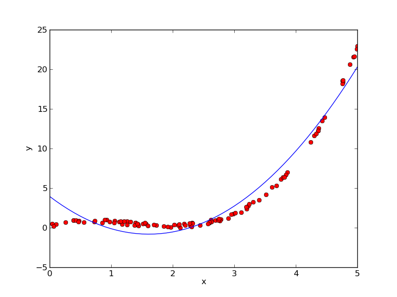
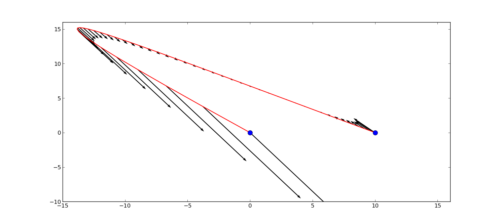
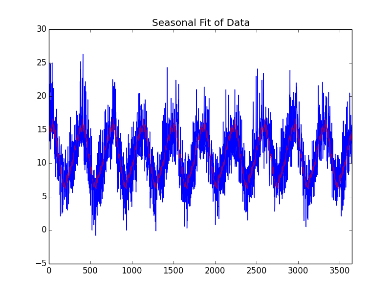

===============
LSQ.jl Examples
===============

This tutorial showcases LSQ.jl through a few involved examples of linearly
constrained least squares problems.
The plots generated by the following examples use the PyPlot package.
Instructions for installing PyPlot can be found `here <https://github.com/stevengj/PyPlot.jl>`_.

Regression
==========
Regression is the problem of trying to fit a function to some data.
In this example, we will frame some simple regression problems as
unconstrained least squares problems for LSQ.jl to solve.
The files for this example can be found `here <https://github.com/davidlizeng/LSQ.jl/tree/master/examples/simple_lin_and_quad_reg>`_.

In this problem, we are given n points, represented by two n-by-1 vectors, ``x_data`` and ``y_data``. The x and y coordinates of the i-th point are given by the i-th entries of ``x_data`` and ``y_data``, respectively.

We'll start by visualizing the data to get a better sense of the problem at hand.
In a Julia shell, run the following code:

.. code-block:: none

  include("data.jl");

If the PyPlot package is installed, the following graph of the data will appear

.. image:: data.png

Linear Regression
-----------------
We will first try to fit a line to the data. A general function for a line is

.. math::
  f(x) = \mbox{offset} +  \mbox{slope} \cdot x

where :math:`\mbox{slope}` and :math:`\mbox{offset}` are scalar quantities that we pick to determine the line.
We would like to pick :math:`\mbox{slope}` and :math:`\mbox{offset}` so that our data points lie "close" to
our line. For a point with coordinates :math`x` and :math:`y` the residual between the point
and our line is defined as

.. math::
  \mbox{residual}(x, y) = f(x) - y

One reasonable way to measure how good the line fits the data is to
sum the squares of the residuals between each point in the data and the line.
Using this measurement as "goodness of fit", we would like to choose :math:`\mbox{slope}`
and :math:`\mbox{offset}` to minimize this quantity.

We can now frame this problem in Julia code and solve our problem using LSQ.jl:

.. code-block:: none

  slope = Variable();
  offset = Variable();
  optval = minimize!(sum_squares(offset .+ x_data * slope - y_data));
  println("Slope = $(slope.value[1, 1]), offset = $(offset.value[1, 1])");

To see a plot of the best fitting line, run:

  .. code-block:: none

    include("linear_regression.jl");

  .. image:: linear.png

Quadratic Regression
--------------------
A line is probably not the best function to fit to this data. Instead, let's try
to fit a quadratic function, which has the form:

.. math::
  f(x) = \mbox{offset} + \mbox{linear_coeff} \cdot x + \mbox{quadratic_coeff} \cdot x ^ 2

We have now introduced a new quadratic term, along with a new coefficient.
The same residual function from the linear regression example can still be used here,
and similarly, we can measure how good the quadratic function fits the data
by summing the squares of the residuals between each point in the data and the
quadratic.

The Julia code to solve this problem using LSQ.jl is the following:

.. code-block:: none

  quadratic_coeff = Variable();
  linear_coeff = Variable();
  offset = Variable();
  optval = minimize!(sum_squares(offset + x_data * linear_coeff + x_data .^ 2 * quadratic - y_data));

To see a plot of the best fitting line, run:

.. code-block:: none

  include("quadratic_regression.jl");

A much better fit than the line!

Control
=======
One common application of linearly constrained least squares is control, i.e.,
planning the motion of an object.

Hitting Waypoints (Terrible title)
----------------------------------
For our example, we want to determine what
forces to apply to an object with some initial position and velocity to bring it to
rest at a final position over some amount of time.

We can simplify the problem by adding a condition that we can only apply constant
forces over fixed length intervals of time, and
that we will have exactly :math:`T` intervals of time, each :math:`h` seconds in length.
Therefore, at each time interval :math:`t`, we have three unknown quantites:
the constant force applied during that interval :math:`f(t)`, the velocity of the object at
the beginning of the interval :math:`v(t)`, and the position of the object at the beginning of
the interval :math:`p(t)`. By the basic laws of physics, these variables must satisfy:

.. math::
  \begin{align*}
    p(t+1) &= p(t) + h \cdot v(t) \\
    v(t+1) &= v(t) + (h/\mbox{mass}) \cdot f(t) - \mbox{drag} \cdot v(t)
  \end{align*}

where :math:`\mbox{mass}` and :math:`\mbox{drag}` are constants for the mass of the object and the drag
coefficient of the fluid the object is moving in.

Additionally, we have our initial/final position/velocity conditions:

.. math::
  \begin{align*}
    p(1) &= \mbox{initial_position}\\
    v(1) &= \mbox{initial_velocity}\\
    p(T+1) &= \mbox{final_position}\\
    v(T+1) &= 0
  \end{align*}

Often we would like to satisfy all of these constraints on the motion of the object
while minimizing something along the lines of how much fuel must be conserved to
generate these forces. Usually it is in our best interest to keep the values of the
forces small. It is also possible that we would like to keep the velocity of the
object small as well, perhaps for safety concerns. One reasonable objective to
minimize then would be

.. math::

  \mbox{objective} = \mu \sum_{t = 1}^{T+1} (v(t))^2 + \sum_{t = 1}^T (f(t))^2

Here :math:`\mu` serves as a parameter to control which part of the objective we
deem more important, keeping the velocity small or keeping the force small.

The code for this problem can be found `here <https://github.com/davidlizeng/LSQ.jl/tree/master/examples/control>`_.
To see a plot of the motion of the object, run the following in a Julia shell:

.. code-block:: none

  include("control.jl");

The red path traces the position of the object over the time, while the black
arrows show the forces applied. The blue dots show the initial and final
positions.

Image Processing
================

Tomography
----------

Tomography is the process of reconstructing a density distrbution from given
integrals over sections of the distribution. The idea can be best visualized using a
two dimensional black and white image. The density distribution in this case
is how much black ink is used in each pixel.
Now, imagine drawing a red line across the image.
The total amount of black ink covered up by the red line can be thought of
as integrals over the line of the density distrbution. If we draw many, many of these
red lines and record the integral for each, can we use just this information to
reconstruct the original image? This is the very similar to the problem that a device like an
x-ray uses to construct a picture of your internals given only information on how
the radiation waves traveled through your body. It turns out the two dimensional
black and white image scenario can be solved by LSQ.

Suppose there are :math:`n` pixels in the picture, each with density value :math:`x_j` for :math:`1 \le j \le n`,
which are currently unknown.
We also take :math:`m` line integrals, where :math:`m > n` each with value :math:`y_i` for :math:`1 \le i \le m`.
We also know how each line passes over which pixels and at what angle. Using this
information, we can represent this problem as

.. math::
  y = Ax

Here, :math:`A` is a matrix where :math:`A_{ij}` represents how much line :math:`i`
passes over pixel :math:`j`. For example, if the line barely touches the corner of a pixel,
the corresponding value for :math:`A_{ij}` would be very small. If the line instead
cross over the pixel straight through the middle, the value for :math:`A_{ij}` would be
relatively big.

Anytime we have measurements, there are usually small errors that occur. So a more
accruate model for our problem would be

.. math::
  y = Ax + v \iff v = Ax - y

Where the error vector :math:`v` is assumed to be small and have zero mean.
It is very reasonable then to try to minimize the sum of squares of the error,
as that would force the resulting :math:`v` to have rather small entries,
and center the mean of the entries at :math:`0`. Thus our problem becomes:

.. math::

  \begin{array}{ll}\mbox{minimize} & \|v\|_2^2 \end{array} \iff
  \begin{array}{ll}\mbox{minimize} & \|Ax - y\|_2^2 \end{array}

which we recognize as an unconstrained least squares problem; something we can
readily solve in LSQ.jl!

The code and data for this example can be found `here <https://github.com/davidlizeng/LSQ.jl/tree/master/examples/tomography>`_.

.. code-block:: none

  import PyPlot.plt
  import PyPlot.cm
  using PyPlot
  using LSQ

  # read in the data
  line_mat_x = readdlm("tux_sparse_x.txt");
  line_mat_y = readdlm("tux_sparse_y.txt");
  line_mat_val = readdlm("tux_sparse_val.txt");
  line_vals = readdlm("tux_sparse_lines.txt");

  img_size = 50
  num_pixels = img_size * img_size

  line_mat = spzeros(3300, num_pixels);

  num_vals = length(line_mat_val)

  # build the matrix. The entry at i,j reflects how much line i
  # intersects pixel j.
  for i in 1:num_vals
    x = int(line_mat_x[i]);
    y = int(line_mat_y[i]);
    line_mat[x + 1, y + 1] = line_mat_val[i];
  end

  # solve the problem using LSQ.jl
  x = Variable(num_pixels)
  objective = sum_squares(line_mat * x - line_vals);
  optval = minimize!(objective);

  plt.imshow(reshape(x.value, img_size,img_size), cmap = get_cmaps()[29])

The final result of the tomography will look something like

.. image:: tomography.png

Machine Learning
================

Binary Classification
---------------------
One common problem found in machine learning is the classification of a group of objects into two subgroups.
In this example, we will work with a collection of text documents, that
come from three sources: sports articles, Harry Potter excerpts, and education articles.
The goal will be to classify each document as either a sports article, or
not a sports article. These sources will only have slight overlap in content, e.g, some
education articles may mention sports and of course Harry Potter plays the sport
of Quidditch.

When classifying text documents, one of the most common techniques is to build
a term-by-document frequency matrix :math:`F`. That is, :math:`F_{ij}`
reflects the frequency of term :math:'j' in document :math:`i`.
A handful of common preprocessing techniques are used to make this more effective, such
as removing overly common words like "the", removing endings in words like "ing",
converting all nouns to singular forms, removing words that appear in too few documents,
and normalizing frequency counts so that longer documents will not outweight shorter ones.

The documents are then split into a training and testing set. For each document
in the training example, we also label the document with the correct label, in this case,
sports or not sports. Often, the numbers :math:`1` and :math:`-1` will be used to represent the labels.
One reasonable approach is to model the label of a document as an affine function
of the term frequencies of the document:

.. math::
  \mbox{label}(i) = v + \sum_{j = 1}^n w_jF_{ij}.

The goal now is to find a scalar :math:`v` and a weight vector :math:`w`, where :math:`w_j` reflects how
important term :math:`j` is in determining the label of the document. In our context, a positive value
means that the term is often seen in sports articles, while a negative value means
the term is often seen in the Harry Potter excerpts or education articles. One reasonable
method of learning :math:`v` and :math:`w` is to use regularized least squares. We
try to minimize the objective:

.. math::
  \sum_{i = 1}^m  \left(\mbox{label}(i) - v - \sum_{j = 1}^n w_jF_{ij}\right)^2 + \lambda \sum_{j = 1}^n w_j^2

The first part of the objective is to ensure that our linear model actually closely
reproduces the labels of our training documents. The second part of the objective
ensures that the components of :math:`w` are relatively small. We want our document
classifier to work on other text documents, not just the ones we trained on. If
the components of :math:`w` are large, then slight changes in term frequecies of
documents would mean drastic changes in the value of the affine function, to the point
where the sign could change. Keeping :math:`w` small allows our model to behave
better on documents not in the training set. The regularization parameter :math:`\lambda`
allows us to control how much we should prioritize keeping :math:`w` small versus
how close the affine function should fit the labels.

Here is the LSQ.jl code:

.. code-block:: none

  include("MatrixMarket.jl")
  using MatrixMarket
  using LSQ

  # read in the data
  A = full(MatrixMarket.mmread("largeCorpus.mtx"));

  # extract the classes of each document
  classes = A[:,1];
  # TODO: modify classes so that 4 5 6 are 1 2 3
  classes[classes .> 3] = classes[classes .> 3] - 3;
  A = A[:, 2:end];

  # split into train/test
  numData = size(A, 1);
  data = randperm(numData);
  ind = floor(numData*0.7);
  training = data[1:ind];
  test = data[ind+1:end];
  trainDocuments = A[training,:];
  trainClasses = classes[training,:];
  testDocuments = A[test,:];
  testClasses = classes[test,:];

  # change all other than sports to -1 (sports is 1)
  holdClass = 1;
  trainClasses[trainClasses .!= holdClass] = -1;
  trainClasses[trainClasses .== holdClass] = 1;
  testClasses[testClasses .!= holdClass] = -1;
  testClasses[testClasses .== holdClass] = 1;

  # build the problem and solve with LSQ
  lambda = 100;
  w = Variable(size(A, 2));
  v = Variable();
  objective = sum_squares(trainDocuments * w + v - trainClasses) + lambda * sum_squares(w);
  optval = minimize!(objective);

  # calculate training error
  yhat = sign(trainDocuments * w.value .+ v.value);
  trainCE =  1/size(trainClasses,1)*sum(trainClasses .!= yhat)

  # calculate performance of our classifier on the test set
  yhat2 = sign(testDocuments * w.value .+ v.value);
  testCE = 1/size(testClasses,1)*sum(testClasses .!= yhat2)

Time Series Analysis
====================
A time series is a sequence of data points, each associated with a time. The time series
is usually organized in increasing order based on time, and often the times are
regularly spaced. In our example, we will work with a time series of daily
temperatures in the city of Melbourne, Australia over a period of a few years.
Heres a picture of the temperature data:

.. image:: melbourne.png

Finding Trends
--------------

The picture motivates a decomposition of the time series. We can easily see that
there is a long term up and down in the temperature over the course of each year.
On top of that there are short term fluctuations in temperature that cause
each year to look slightly different.
Using our least squares methods, we will try to find a time series
that repeats itself every year that best captures the seasonal up and downs in
temperature, and separate this from the daily fluctuations.

We can represent the seasonal trend in temperature as a vector where the :math:`i`-th
entry denotes the temperature on the :math:`i`-th day.
To force this trend to repeat yearly, we simply want

.. math::
  \mbox{seasonal}(i) = \mbox{seasonal}(i + 365)

for each applicable :math:`i`. This can easily be encapsulated in linear
equality constraints our sesonal temperature variable.

We also want the seasonal trend to have two more properties. The first is that
the seasonal trend should be relatively close to the actual temperature of that day.
Short term fluctuations in temperature can only cause so much deviation.
The second is that the change in temperature of the seasonal trend from day to
day should be relatively small. Sudden jumps in temeprature are better described
by the short term fluctuations than the long term trends. Therefore, we would like
to minimize the value of the following objective

.. math::
  \sum_{i = 1}^n (\mbox{seasonal}(i) - \mbox{actual}(i))^2 + \lambda \sum_{i = 2}^n(\mbox{seasonal}(i) - \mbox{seasonal}(i - 1))^2

where :math:`\lambda` is the smoothing parameter. The larger :math`\lambda` is, the more
we favor the seasonal trend to be smooth, i.e., the seasonal trend should have small
change from day to day.

The following code uses LSQ.jl to find and plot the seasonal trend:

.. code-block:: none

  # read in the data
  temps = readdlm("melbourne_temps.txt", ',');
  n = size(temps, 1);

  # enforce the seasonal trend to be the same every year
  seasonal = Variable(n);
  eq_constraints = EqConstraint[]
  for i in 365 + 1 : n
    eq_constraints += seasonal[i] == seasonal[i - 365];
  end

  # build the objective and solve the problem
  smoothing = 3;
  smooth_objective = sum_squares(seasonal[1 : n - 1] - seasonal[2 : n]);
  optval = minimize!(sum_squares(temps - seasonal) + smoothing * smooth_objective, eq_constraints);
  residuals = temps - seasonal.value;

  # plot seasonal trend
  plt.figure(1)
  plt.plot(temps)
  plt.plot(seasonal.value, color="r", alpha=0.5)
  plt.title("Seasonal Fit of Data")
  plt.xlim([0, n])

Modeling Fluctuations
---------------------

The next step is to model out short term fluctuations. We subtract our seasonal
trend from the actual temperatures to get our residual temperatures, i.e., deviations from the
seasonal trend temperatures. A reasonable hypothesis is that the residual temperature
today depends on some linear combination of the residual temperatures over the last
five days. If the last couple of days were abnormably hot, chances are today will also be pretty hot.
Such a model is called an autoregressive model. We are essentially trying to fit the data
as a function of other parts of the data itself.
Therefore, we want to find a vector of coefficients :math:`a` such that

.. math::
  \mbox{residual}(i) \approx \sum_{j = 1}^5 a_j \mbox{residual}(i - j)

This can be done by simply minimizing the following sum of squares objective

.. math::
  \sum_{i = 6}^n \left(\mbox{residual}(i) - \sum_{j = 1}^5 a_j \mbox{residual}(i - j)\right)^2

The following LSQ.jl code solves this problem and plots our autoregressive model
against the actual residual temperatures:

.. code-block:: none

  # Generate the residuals matrix
  ar_len = 5;
  residuals_mat = residuals[ar_len : n - 1];
  for i = 1:ar_len - 1
    residuals_mat = [residuals_mat residuals[ar_len - i : n - i - 1]];
  end

  # Solve autoregressive problem
  ar_coef = Variable(ar_len);
  optval2 = minimize!(sum_squares(residuals_mat * ar_coef - residuals[ar_len + 1 : end]));

  # plot autoregressive fit of daily fluctuations
  plt.figure(2)
  plt.plot(residuals[ar_len + 1 : end], color="g", alpha=1)
  plt.plot(residuals_mat * ar_coef.value, color="r", alpha=0.5)
  plt.title("Autoregressive Fit of Residuals")
  plt.xlim([0, n])

.. image:: ar_fit.png

Now, we can add our autoregressive model for the residual temperatures to our
seasonal trend to get an overall model for the daily temperatures in the city of
Melbourne:

.. code-block:: none

  # plot final fit of data
  total_estimate = seasonal.value
  total_estimate[ar_len + 1 : end] += residuals_mat * ar_coef.value
  plt.figure(3)
  plt.plot(temps)
  plt.plot(total_estimate, color="r", alpha=0.5)
  plt.title("Total Fit of Data")
  plt.xlim([0, n])

.. image:: total_fit.png

Our model does a pretty decent job capturing both the long term and short term
trends in temperatures.

